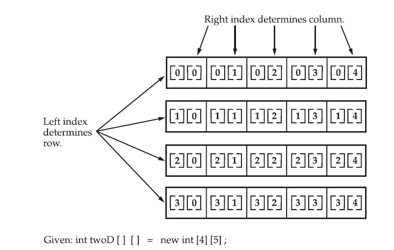

># Arrays

An array stores a fixed-size sequential collection of elements of the same type. An array is used to store a collection of data, but it is often more useful to think of an array as a collection of variables of the same type. A specific element in an array is accessed by its index. Arrays offer a convenient means of grouping related information. Indexing in and array starts at $0$ to $n-1$ where $n$ is the length of array

## One Dimensional Array

To use an array in a program, you must declare a variable to reference the array, and you must specify the type of array the variable can reference.


##### Example 1

```java
public class ArrayExample1{
    public static void main(String[] args){

        // Creating an array
        int[] arr = {1, 2, 3, 4, 5};

        //accessing values by index 
        System.out.println(arr[4]);
    }
}
```

##### Output

    5


#### By Using 'new' Keyword

##### Example 2

```java
public class ArrayExample{
    public static void main(String[] args){
        // declaring a reference for int array
        int[] integerArray;

        // creating array of size 5
        // this array will be able to store 5 values
        integerArray = new int[5];

        // assigning values
        integerArray[0] = 5;
        integerArray[1] = 10;
        integerArray[2] = 15;
        integerArray[3] = 20;
        integerArray[4] = 25;

        // getting length of the array
        int len = integerArray.length;

        for(int i=0; i<len; i++){
            System.out.println(integerArray[i]);
        }
    }
}
```

##### Output

    5
    10
    15
    20
    25

Alternatively Arrays can also be created as

```java
int integerArray[] = new int[5];
```
both are valid ways of creating arrays

#### Multidimensional Arrays

In Java, multidimensional arrays are actually arrays of arrays. These, as you might expect, look and act like regular multidimensional arrays. However, as you will see, there are a couple of subtle differences. To declare a multidimensional array variable, specify each additional index using another set of square brackets. For example, the following declares a twodimensional array variable called twoD:
```java
int[][] twoD = new int[4][5];
```
This allocates a 4 by 5 array and assigns it to twoD. Internally, this matrix is implemented as an array of arrays of int. Conceptually, this array will look like the one shown in Figure 3-1. The following program numbers each element in the array from left to right, top to bottom, and then displays these values:

##### Example 3

```java
// Demonstrate a two-dimensional array.
class TwoDArray {
    public static void main(String args[]) {
        int twoD[][]= new int[4][5];
        int i, j, k = 0;
        for(i=0; i<4; i++){
            for(j=0; j<5; j++) {
                twoD[i][j] = k;
                k++;
            }
        }
        for(i=0; i<4; i++) {
            for(j=0; j<5; j++){
                System.out.print(twoD[i][j] + " ");
            }
            System.out.println();
        }
    }
}
```

##### Output

    0 1 2 3 4
    5 6 7 8 9
    10 11 12 13 14
    15 16 17 18 19


##### Example 4

```java
public class TwoDArray2{
    public static void main(String[] args){
        int[][] intArray = {
            {'1', '2', '3'},
            {'2', '3', '4'}
        };

        int i, j;
        for(i=0; i<2; i++){
            for(j=0; j<3; j++){
                System.out.print(intArray[i][j] + " ");
            }
            System.out.println();
        }
    }
}
```


##### Output

    1 2 3
    2 3 4


#### Conceptual View of 4 by 5 2D array




## External Resources

* [Oracle Tutorials](https://docs.oracle.com/javase/tutorial/java/nutsandbolts/arrays.html)
* [JavaTPoint](https://www.javatpoint.com/array-in-java)

#### More Examples and Practice Questions

* [W3Resources](https://www.w3resource.com/java-exercises/array/index.php)
* [CodesDope](https://www.codesdope.com/practice/java-array/)