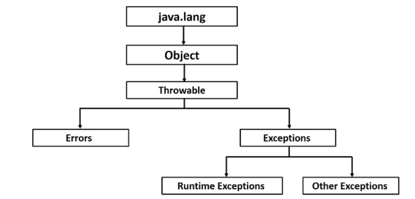

># Exception Handling Fundamentals

A Java exception is an object that describes an event that has occurred in a piece of code that disrupts the normal flow of instructions. When an exceptional condition arises, an object representing that exception is created and thrown in the method that caused the error. That method may choose to handle the exception itself, or pass it on. Either way, at some point, the exception is caught and processed.

An exception can occur for many different reasons. Following are some scenarios where an exception occurs.
* A user has entered an invalid data.
* A file that needs to be opened cannot be found.
* A network connection has been lost in the middle of communications or the JVM has run out of memory.

## Types of Exceptions

Based on these, we have three categories of Exceptions. You need to understand them to know how exception handling works in Java.

### Checked Exceptions

A checked exception is an exception that is checked (notified) by the compiler at compilation-time, these are also called as compile time exceptions. These exceptions cannot simply be ignored, the programmer should take care of (handle) these exceptions.

For example, if you use FileReader class in your program to read data from a file, if the file specified in its constructor doesn't exist, then a FileNotFoundException occurs, and the compiler prompts the programmer to handle the exception.

##### Example 01

```java
import java.io.File;
import java.io.FileReader;

public class FilenotFound_Demo {

   public static void main(String args[]) {		
      File file = new File("E://file.txt");
      FileReader fr = new FileReader(file); 
   }
}
```

##### Output
If you try to compile the above program you will get the following exceptions


    C:\>javac FilenotFound_Demo.java
    FilenotFound_Demo.java:8: error: unreported exception FileNotFoundException; must be caught or declared to be thrown
        FileReader fr = new FileReader(file);
                        ^
    1 error


### Unchecked Exception

Runtime Exceptions are also known as Unchecked Exceptions. These exceptions are not checked at compile-time so compiler does not check whether the programmer has handled them or not but it’s the responsibility of the programmer to handle these exceptions and provide a safe exit. For example, ArithmeticException, NullPointerException, ArrayIndexOutOfBoundsException etc.

##### Example 02

```java
class Exc1 {
    static void subroutine() {
        int d = 0;
        int a = 10 / d;
    }
    public static void main(String args[]) {
        Exc1.subroutine();
    }
}
```

##### Output

    java.lang.ArithmeticException: / by zero
        at Exc1.subroutine(Exc1.java:4)
        at Exc1.main(Exc1.java:7)


The bottom of the stack is main’s line 7, which is the call to subroutine( ), which caused the exception at line 4. The call stack is quite useful for debugging, because it pinpoints the precise sequence of steps that led to the error.


### Errors
These are not exceptions at all, but problems that arise beyond the control of the user or the programmer. Errors are typically ignored in your code because you can rarely do anything about an error. For example, if a stack overflow occurs, an error will arise. They are also ignored at the time of compilation.

## Exception Hierarchy
All exception and error types are subclasses of class Throwable, which is the base class of hierarchy. One branch is headed by Error which occurs at run-time and other by Exception that can happen either at compile time or run-time.



Basically, an Error is used by the Java run-time system (JVM) to indicate errors that are associated with the run-time environment (JRE). StackOverflowError is an example of such an error. Whereas Exception is used for exceptional conditions that user programs should catch. NullPointerException is an example of such an exception.

## Errors VS Exception

|Errors|Exceptions|
|------|----------|
|Recovering from Error is not possible.|We can recover from exceptions by either using try-catch block or throwing exceptions back to caller.|
|All errors in java are unchecked type.|Exceptions include both checked as well as unchecked type.|
|Errors are mostly caused by the environment in which program is running.|Program itself is responsible for causing exceptions.|
|Errors occur at runtime and not known to the compiler.|All exceptions occurs at runtime but checked exceptions are known to compiler while unchecked are not.|


## External Resources

### Readings

* [Oracle Tutorials - Exceptions](https://docs.oracle.com/javase/tutorial/essential/exceptions/definition.html)
* [Oracle Tutorials - Types of Exceptions](https://docs.oracle.com/javase/tutorial/essential/exceptions/catchOrDeclare.html)
* [JavaTPoint](https://www.javatpoint.com/exception-handling-in-java)
* [GeeksForGeeks - Exceptions](https://www.geeksforgeeks.org/exceptions-in-java/)
* [GeeksForGeeks - Errors VS Exception](https://www.geeksforgeeks.org/errors-v-s-exceptions-in-java/)

### Youtube Videos

* [Alex Lee](https://www.youtube.com/watch?v=xNVlq9IEBEg&list=PL59LTecnGM1Mg6I4i_KbS0w5bPcDjl7oz&index=10)

#### More Examples and Practice Questions

Provided in the last chapter of this section